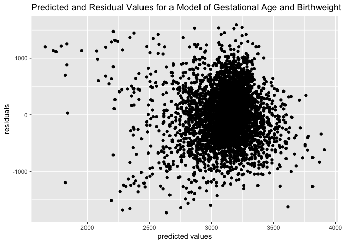
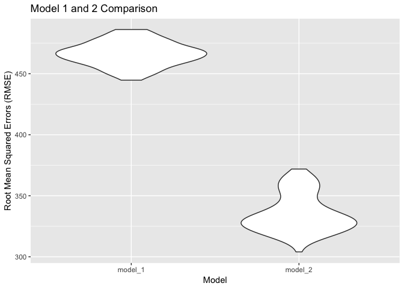
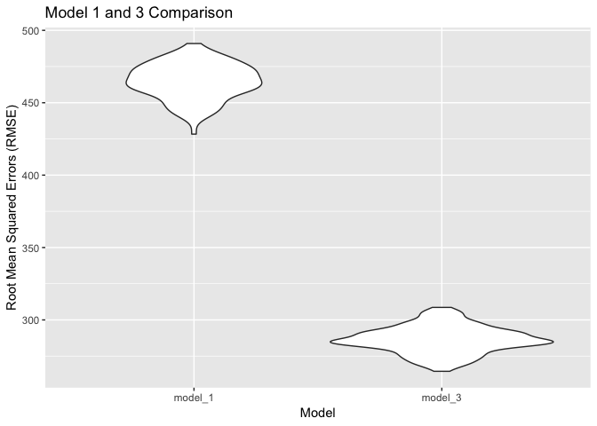

Homework 6, Amelia Grant-Alfieri, ag3911
================

# Problem 1: Analyzing homicide data in the United States.

## Tidy Data and Create New Variables

  - create a city\_state variable (e.g. “Baltimore, MD”)
  - create a binary variable indicating whether the homicide is
    resolved.
  - omit cities Dallas, TX; Phoenix, AZ; and Kansas City, MO – these
    don’t report victim race  
  - omit Tulsa, AL – this is a data entry mistake
  - modifiy victim\_race to have categories white and non-white, with
    white as the reference category
  - be sure that victim\_age is numeric.

I defined resolved as “closed by arrest”.

``` r
library(tidyverse)
library(rvest)
library(httr)
library(tidyr)
library(stringr)
library(forcats)
library(dplyr)
library(plyr)
library(stats)
library(purrr)
library(broom)
library(ggplot2)
getwd()
```

    ## [1] "/Users/ameliaga/Documents/MPH Sem 3/Data Science/p8105_hw6_ag3911/Homework 6"

``` r
tidy = read_csv("./homicide-data.csv") %>%
  select(victim_age, victim_race, victim_race, victim_age, victim_sex, city, state, disposition) %>%
  filter(city != "Dallas", city != "Phoenix", city != "Kansas City") %>%
  mutate(Tulsa_AL = (state == "AL" & city == "Tulsa")) %>%
  filter(Tulsa_AL == FALSE) %>%
  filter(victim_age != 102, victim_age != 101) %>%
  filter(victim_race != "Unknown" | victim_race == "NA") %>%
  filter(victim_age != "Unknown", victim_sex != "Unknown") %>%
  mutate(city_state = str_c(city, ", ", state),  
         resolved = as.numeric(disposition == "Closed by arrest"),
         age = as.numeric(victim_age),
         victim_race = ifelse(victim_race == "White", "white", "nonwhite"), 
         race = factor(victim_race),
         sex = factor(victim_sex), 
         race2 = relevel(race, ref = "white")) %>%  
  select(-city, -state, -Tulsa_AL, -disposition)
```

## Logistic Regression Model for Baltimore, Maryland

  - For the city of Baltimore, MD, use the glm function to fit a
    logistic regression with resolved vs unresolved as the outcome and
    victim age, sex and race (as just defined) as predictors.
  - Save the output of glm as an R object
  - apply the broom::tidy to this object

<!-- end list -->

``` r
baltimore = tidy %>%
  select(resolved, age, race2, sex)

balt_fit = 
  baltimore %>% 
  glm(resolved ~ age + race2 + sex, data = ., family = binomial())
```

Obtain the estimate and confidence interval of the adjusted odds ratio
for solving homicides comparing non-white victims to white victims
keeping all other variables fixed.

``` r
balt_fit %>%  
  broom::tidy() %>% 
  mutate(OR = exp(estimate)) %>%
  filter(term == "race2nonwhite") %>%   
  select(term, log_OR = estimate, std.error, OR) %>% 
  mutate(conf.high = exp(log_OR + 1.96*std.error),  
         conf.low = exp(log_OR - 1.96*std.error)) %>%
  knitr::kable(digits = 3)
```

| term          | log\_OR | std.error |    OR | conf.high | conf.low |
| :------------ | ------: | --------: | ----: | --------: | -------: |
| race2nonwhite | \-0.576 |     0.029 | 0.562 |     0.595 |    0.531 |

The adjusted odds ratio is 0.562 with a 95% confidence interval of
(0.531, 0.595).

## Logistic Regression for Each City

Run glm for each of the cities in your dataset and extract the adjusted
odds ratio (and CI) for solving homicides comparing non-white victims to
white victims. Do this within a “tidy” pipeline, making use of
purrr::map, list columns, and unnest as necessary to create a dataframe
with estimated ORs and CIs for each city.

``` r
#all_city = tidy %>%
  #group_by(city_state) %>%
  #nest() %>% 
  #mutate(output = map(data, ~glm(resolved ~ age + race2 + sex, data = tidy, family = #binomial())), 
         #output = map(output, broom::tidy)) %>%
  #select(-data) %>%
  #unnest()
```

## Plot Estimated Odds Ratios and Confidence Intervals for Each City

Create a plot that shows the estimated ORs and CIs for each city.
Organize cities according to estimated OR, and comment on the plot.

``` r
#all_city %>% 
  #mutate(term = fct_inorder(term)) %>% 
  #spread(key = term, value = estimate) %>% 
  #select(city_state, term, log_OR = estimate, std.error) %>% 
  #mutate(OR = exp(log_OR)) %>%
  #filter(term == "race2nonwhite") %>%   
  #mutate(conf.high = exp(log_OR + 1.96*std.error),  
         #conf.low = exp(log_OR - 1.96*std.error)) %>%
  #knitr::kable(digits = 3)

#manhattan_nest_lm_res %>% 
  #group_by(city_state) %>%
  #ggplot(aes(x = reorder(city_state, -OR), y = OR)) + + geom_errorbar(aes(ymin = conf.low, ymax = conf.high, width = 0.2)) + geom_point() + labs(x = "Location", y = "log-transformed Odds Ratio", title = "The Odds of Solving Homicides for Non-White compared to White Victims by City, State") + theme(axis.text.x = element_text(angle = 90))
```

I cannot comment on the plot because I do not know what it looks
like.

# Problem 2: Understanding the effects of several variables on a child’s birthweight.

## Load and Tidy Data

Load and clean the data for regression analysis (i.e. convert numeric to
factor where appropriate, check for missing data, etc.).

``` r
p2_tidy = read_csv("./birthweight.csv") %>%
  janitor::clean_names() %>%
  select(bwt, blength, gaweeks, bhead, babysex) %>%
  mutate(babysex = as.factor(babysex), 
         gaweeks = as.numeric(gaweeks)) %>%
  mutate(babysex = recode(babysex, `1` = "male", `2` = "female")) 
```

## Birthweight Regression Models

### Model \#1

My proposed model uses gestational age (in weeks) as a predictor of
birthweight. In general, premature babies, those with a younger
gestational age in utero, weigh less than full-term babies. This
relationship is supported biologically by the rapid growth and weight
gain a fetus is supposed to undergo during the final trimester in utero.

``` r
library(tidyverse)
library(modelr)
library(mgcv)

model_1 = lm(bwt ~ gaweeks, data = p2_tidy) 
  broom::tidy() 
```

    ## # A tibble: 0 x 0

Plot of model of residuals against fitted values using add\_predictions
and add\_residuals.

``` r
model_1_plot = p2_tidy %>%
  modelr::add_residuals(model_1) %>%
  modelr::add_predictions(model_1) %>%
  ggplot(aes(x = pred, y = resid)) + geom_point() + labs(x = "predicted values", y = "residuals", title = "Predicted and Residual Values for a Model of Gestational Age and Birthweight")
model_1_plot
```

<!-- -->

Model \#1 shows a positive relationship between gestational age and
birthweight. There is little data on gestational age earlier than 30
weeks, which makes sense because babies delivered at that time would be
extremely underdeveloped. The residual is fairly randomly dispersed
along the horixontal axis, indicating that this model is a decent fit
for the data.

### Model \#2

The second model uses length at birth and gestational age as predictors
(main effects only) of birthweight.

``` r
model_2 = lm(bwt ~ blength + gaweeks, data = p2_tidy) %>%
  broom::tidy() 
```

### Model \#3

The third model uses head circumference, length, sex, and all
interactions (including the three-way interaction) as predictors of
birthweight.

``` r
model_3 = lm(bwt ~ bhead + babysex + blength + bhead*babysex + bhead*blength + bhead*babysex*blength + blength*babysex, data = p2_tidy) %>%
  broom::tidy() 
```

### Compare Models \#1 and \#2

Compare in terms of the cross-validated prediction error (use crossv\_mc
and functions in purrr as appropriate).

``` r
cv_12 = crossv_mc(p2_tidy, 100) %>%
  mutate(model_1 = map(train, ~lm(bwt ~ gaweeks, data = p2_tidy)),
         model_2 = map(train, ~lm(bwt ~ blength + gaweeks, data = p2_tidy))) %>%
  mutate(rmse_model_1 = map2_dbl(model_1, test, ~rmse(model = .x, data = .y)),
         rmse_model_2 = map2_dbl(model_2, test, ~rmse(model = .x, data = .y)))

cv_12 %>%
  select(starts_with("rmse")) %>% 
  gather(key = model, value = rmse) %>% 
  mutate(model = str_replace(model, "rmse_", ""),
         model = fct_inorder(model)) %>% 
  ggplot(aes(x = model, y = rmse)) + geom_violin() + labs(y = "Root Mean Squared Errors (RMSE)", x = "Model", title = "Model 1 and 2 Comparison")
```

<!-- -->

Model \#2 appears to be a better fit for the data because it has a
smaller RMSE than Model \#1.

### Compare Models \#1 and \#3

Compare in terms of the cross-validated prediction error (use crossv\_mc
and functions in purrr as appropriate).

``` r
cv_13 = crossv_mc(p2_tidy, 100) %>%
  mutate(model_1 = map(train, ~lm(bwt ~ gaweeks, data = p2_tidy)),
         model_3 = map(train, ~lm(bwt ~ bhead + babysex + blength + bhead*babysex + bhead*blength + bhead*babysex*blength + blength*babysex, data = p2_tidy))) %>% 
  mutate(rmse_model_1 = map2_dbl(model_1, test, ~rmse(model = .x, data = .y)),
         rmse_model_3 = map2_dbl(model_3, test, ~rmse(model = .x, data = .y)))

cv_13 %>%
  select(starts_with("rmse")) %>% 
  gather(key = model, value = rmse) %>% 
  mutate(model = str_replace(model, "rmse_", ""),
         model = fct_inorder(model)) %>% 
  ggplot(aes(x = model, y = rmse)) + geom_violin() + labs(y = "Root Mean Squared Errors (RMSE)", x = "Model", title = "Model 1 and 3 Comparison")
```

<!-- -->

Model \#3 appears to be a better fit for the data because it has a
smaller RMSE than Model \#1.
